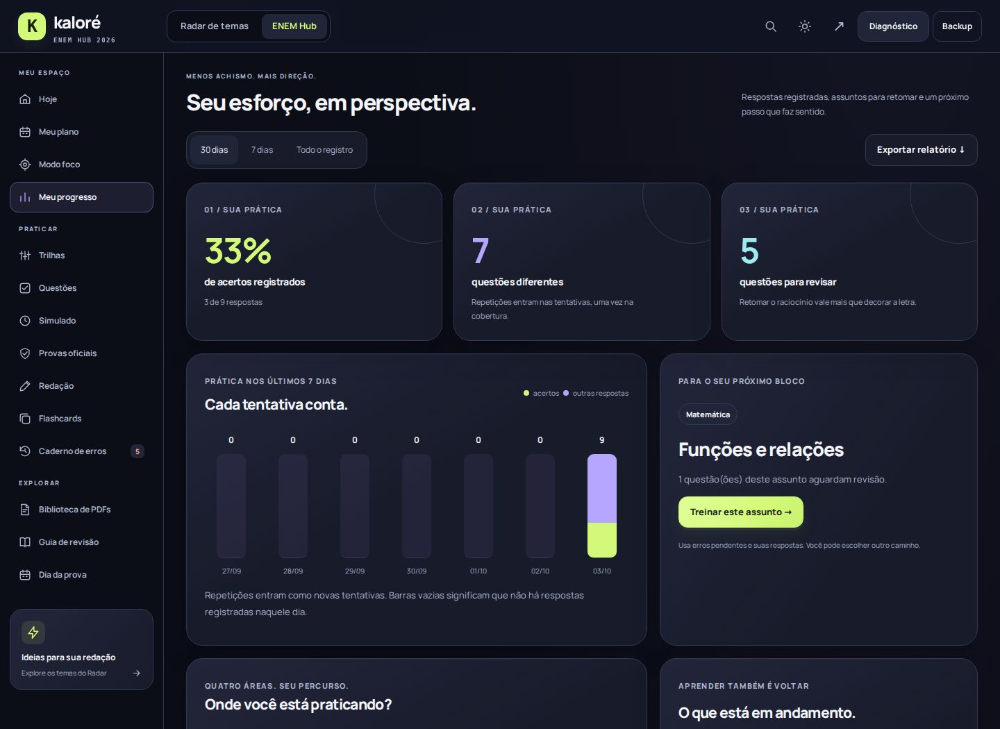
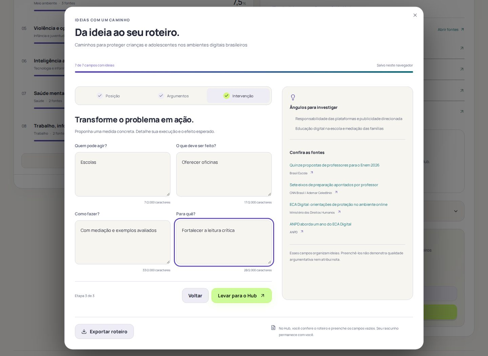

# Radar ENEM + ENEM Hub · clareza e prática

## Redação e aplicativo offline · 5 de outubro de 2026

O **Laboratório de ideias** é uma base editorial compartilhada pelo Radar, pelo Hub e pelo app offline. Ele usa os mesmos 17 IDs de tema do Radar. Cada eixo possui três recortes de treino, dois caminhos distintos e, em cada caminho, uma tese, dois argumentos estruturados (afirmação, explicação, exemplo hipotético e pergunta de ligação), quatro partes de intervenção, conceitos para estudar, alertas e perguntas de revisão. Uma leitura curada do Inep acompanha o tema, para consulta quando houver conexão. Nenhuma pontuação ou tema previsto é atribuído.

No Radar, o banco se abre dentro do roteiro em três etapas. No Hub, fica no laboratório de redação ao lado do editor. O estudante pode escolher um campo ou preencher os vazios do caminho inteiro. Campos ocupados nunca são substituídos; se não houver espaços vazios, nada muda. Trocar o tema requer uma ação explícita e mantém o rascunho. O guia completo do tema pode ser baixado em Markdown.

### Arquivo autônomo

`estudar-offline.html` empacota HTML, nove folhas de estilo, dezesseis scripts, a fonte local, os dados e os quatro PDFs autorais em um único arquivo de aproximadamente 874 KiB. O app abre por `file://`, funciona desde a primeira execução sem visitar o site, conserva dados no armazenamento do navegador para aquele arquivo e aparelho, e não faz requisições HTTP. Cronômetro, biblioteca dos cadernos Kaloré, temas, treino, escrita, histórico e backups usam recursos locais. Links externos mostram um aviso; cadernos oficiais hospedados pelo Inep e outros materiais online ficam disponíveis quando há conexão.

O service worker da versão publicada passou a precachear 51 arquivos. Essa instalação continua sendo uma alternativa após uma visita com internet; o arquivo autônomo é a cópia que funciona na primeira abertura totalmente offline. Os dois modos não sincronizam seus dados entre si.

Verificação desta versão: conteúdo e alinhamento automático dos 17 temas, 34 rotas, 68 argumentos, 34 intervenções, tipagem, busca, navegação nos dois produtos, preservação de rascunho e campos, auditoria automatizada da interface, abertura direta de `file://`, salvamento após recarregar, download dos quatro PDFs como arquivos válidos, bloqueio de navegação externa, zero solicitações de rede e largura móvel de 360 px.

Esta evolução acrescenta direção ao estudo: registrar respostas, escolher o assunto a revisar e transformar uma ideia do Radar em um roteiro de redação. A identidade compartilhada continua em grafite, lima, lilás e ciano, com tema claro em gelo e creme.

## Mudanças aplicadas

| Recurso | Comportamento |
| --- | --- |
| Meu progresso | Períodos de 7 dias, 30 dias e todo o registro; acertos por área, questões diferentes e gráfico diário de tentativas. Amostras pequenas e ausência de dados ficam explícitas. |
| Mapa de assuntos | 20 assuntos editoriais, com contagem de tentativas e erros pendentes. Um clique abre o banco com área e assunto selecionados. |
| Próximo treino | Prioriza erros pendentes; depois, assuntos com pelo menos três tentativas e menos de 70% de acertos nos últimos 30 dias. Sem esse histórico, considera a dificuldade escolhida e itens pouco praticados. É uma regra local, não uma previsão de desempenho. |
| Banco de questões | 84 itens autorais: 60 de fundamentos e 24 contextualizados novos, seis por área, com cinco alternativas, pistas e explicações. Busca sem depender de acentos, filtros por área, assunto, situação e contexto, seis itens por página. |
| Prática por assunto | Uma questão por tela; teclado 1–5, confiança opcional, comentário, anotação e próxima questão do assunto. A opção escolhida recebe texto e ícones de correção. Acertar um erro pendente encerra sua revisão. |
| Acertos com dúvida | A confiança informada pode identificar respostas certas em que o aluno ainda quer rever o raciocínio. A interface não infere uma confiança que ele não informou. |
| Relatório | Exportação em Markdown com resumo, assuntos, tentativas e anotações. O backup v5 preserva os campos opcionais; versões 3 e 4 continuam aceitas. |
| Roteiro no Radar | Sete campos em três etapas: posição, argumentos e intervenção. As ideias são salvas por tema, com fontes e repertórios ao lado; exportação e backup incluem o roteiro. |
| Radar → Hub | O planejamento é apresentado antes de aplicar. Preenche apenas campos vazios do roteiro; preserva o texto e, quando há rascunho, seu tema. A transferência tem validação e expira após 24 horas. Nenhum texto pessoal vai no endereço. |
| Navegação móvel | Cinco destinos na barra inferior: Hoje, Questões, Redação, Progresso e Mais. O menu nativo apresenta todas as 14 ferramentas em grupos. A antiga faixa horizontal deixa de disputar espaço no celular. |
| Legibilidade em movimento | Transições de botões preservam movimento, borda e sombra, com as cores aplicadas imediatamente na troca de tema. Entradas e celebrações usam o sistema nativo existente e respeitam movimento reduzido. |
| Backups maiores | O limite de importação sobe de 2 para 12 MB, mantendo validação e limites por campo. Um histórico válido com várias redações pode ultrapassar o limite anterior; o percurso de exportação/importação foi verificado. |

O detalhamento considera as últimas 1.000 tentativas válidas registradas nesta versão. Cada repetição é uma tentativa; cobertura conta IDs diferentes. Questões em branco de um simulado concluído entram como tentativas sem acerto. Dados futuros, itens desconhecidos, opções inexistentes e áreas incompatíveis são excluídos da análise.

O aproveitamento geral anterior continua preservado. Não foram inventadas áreas, respostas ou datas para reconstruir o histórico antigo. Treinos oficiais com registro manual permanecem separados. Lições concluídas, XP, confiança e acertos não equivalem a domínio ou nota TRI.

## Validação

- Regras do Radar, recomendações, calendário de São Paulo, prática guiada e compatibilidade dos backups.
- 84 IDs únicos, cobertura editorial de todos os itens, alternativas e cálculos independentes das questões numéricas novas.
- Registro das três formas existentes de responder: blocos, sessões guiadas e simulados; prática por assunto como nova origem.
- Erro, retomada sem gabarito aberto, acerto, encerramento da pendência, confiança, busca, filtros, anotação e exportação.
- Simulado concluído com cinco respostas em branco: cinco registros, sem acertos inventados.
- Preservação de rascunho, tema e campos preenchidos ao receber o roteiro; seleção do tema quando o editor está vazio.
- Importação de backup válido acima de 2 MB e restauração de uma cópia normal.
- Novas telas a 360, 390 e 768 px, nos dois temas; roteiro no desktop com largura real superior a 1.000 px.
- Fluxos anteriores de estudo, PDFs, provas oficiais, CSV, tempo, backup e uso offline.
- 97 estados auditados por axe-core/playwright 4.13.0, sem violações automáticas de regras WCAG A/AA. Isso não é certificação nem substitui testes com tecnologias assistivas.

O workflow **Product quality** executa as verificações em cada atualização. **Published site smoke check** compara 22 recursos públicos com os arquivos validados: aplicação, estilos, novos modelos, fontes, worker e PDF.

## Desempenho

As medições desta rodada ficam em `portable/public/data/clarity-performance-audit.json`. O experimento compara o build publicado anterior com esta versão, em servidor local, três execuções por página, viewport 390×844, CPU 4×, latência 150 ms e download de 1,6 Mbps. Cache frio e service worker bloqueado; transferência com gzip. São observações de laboratório, não dados do p75 de usuários nem promessa de melhora percentual.

| Página | Build | LCP | CLS | Tarefas longas acima de 50 ms | Transferência inicial |
| --- | --- | --- | --- | --- | --- |
| Radar | Anterior | 1764 ms | 0 | 316 ms | 194236 B |
| Radar | Novo | 1780 ms | 0 | 309 ms | 198584 B |
| Hub | Anterior | 840 ms | 0,0096 | 298 ms | 133437 B |
| Hub | Novo | 904 ms | 0,0078 | 247 ms | 159636 B |
| Guia de redação | Novo | 444 ms | 0,017 | 26 ms | 37095 B |

A transferência inicial aumenta cerca de 4,3 KB no Radar e 26,2 KB no Hub, com os modelos, catálogo e novas telas. O LCP observado aumenta 16 ms e 64 ms, respectivamente. O tempo bloqueado do Hub e seu CLS diminuem nesta amostra. Nenhuma dessas medições demonstra uma melhora de 200% na qualidade do produto.

## Arquitetura

- `hub/insights-model.js`: validação, calendário, agregação e prioridade, sem dependência da interface.
- `hub/practice-data.js`: taxonomia, estratégias e 24 questões autorais novas.
- `hub/insights.js` e `hub/insights.css`: progresso, catálogo, sala de questão e menu móvel. Os painéis de dados são atualizados ao abrir ou quando há novos registros.
- `shared/brief.js`: validação compartilhada do planejamento e da transferência.
- `components/writing-canvas.tsx`: roteiro em etapas no Radar, com fontes, exportação e passagem ao Hub.
- As funções existentes de correção e recompensa continuam sendo usadas; a nova camada não concede respostas duplicadas ao retomar a sessão guiada.
- O produto publicado continua estático e funciona com os dados locais. Não exige um servidor novo nem envia redações a um serviço de IA.

## Capturas da aplicação real

O painel abaixo usa as respostas executadas pelo teste, incluindo um simulado em branco. Não representa desempenho de um estudante nem uma estatística de usuários. As capturas são produzidas pelo navegador real, nos dois temas.

