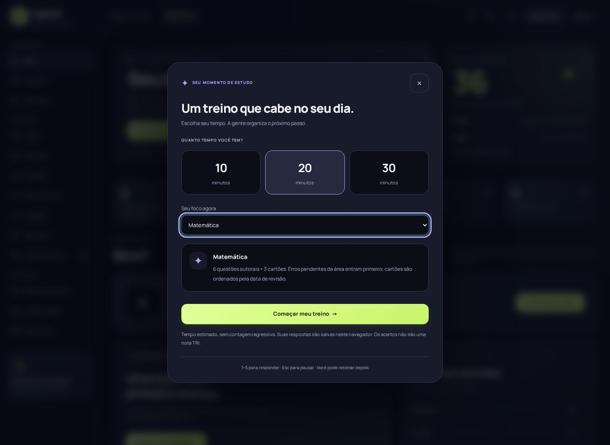
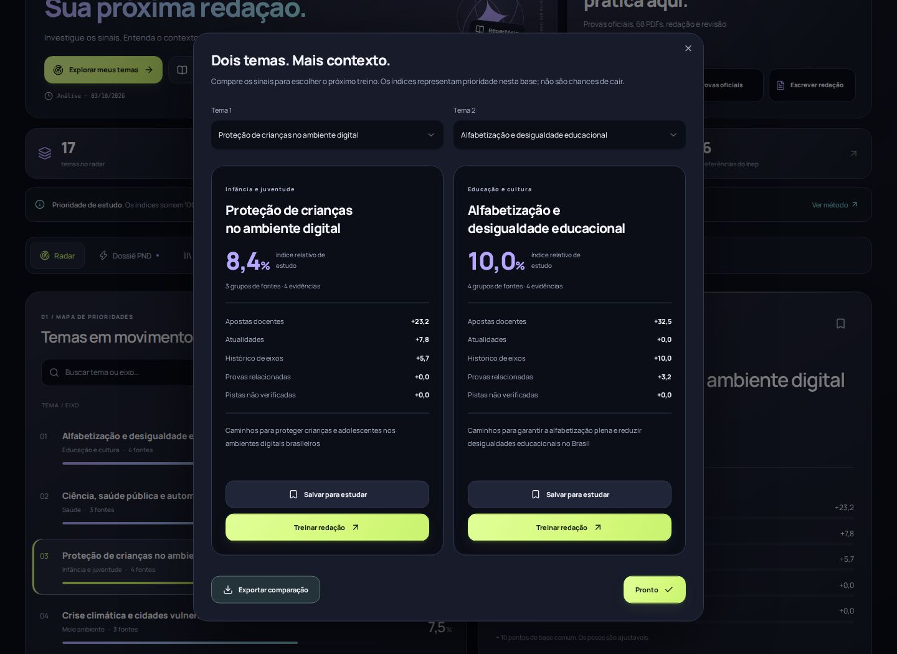

# Radar ENEM + ENEM Hub · nova experiência

Esta versão aproxima o produto de um aplicativo de estudo: prática guiada, escrita concentrada e organização das ideias no próprio Radar. A evolução foi aplicada aos dois produtos e ao build que o GitHub Pages publica.

## O que mudou para quem estuda

| Recurso | Comportamento implementado |
| --- | --- |
| Sessão guiada | Escolha 10, 20 ou 30 minutos estimados e uma área, ou use a prioridade do seu perfil. O Hub reúne questões e cartões em uma sequência com uma atividade por tela. |
| Retomada | Cada resposta e revisão é salva. Fechar a sessão ou recarregar mantém o ponto atual; abrir uma resposta já feita não concede XP novamente. |
| Revisão útil | Questões com erros pendentes da área entram primeiro. Acertar essa questão no treino encerra sua revisão no caderno de erros. Cartões são ordenados pela data de revisão e usam o agendamento existente. |
| Meta semanal | Escolha 3, 5 ou 7 dias. O gráfico usa atividades reais, de segunda a domingo, no calendário de São Paulo. Dias futuros não entram na meta. |
| Histórico | Sessões concluídas registram acertos, questões, cartões e tempo de prática com a janela aberta e a página visível. O total não é uma nota TRI. |
| Modo escrita | O editor original ocupa uma sala sem a navegação do Hub. O rascunho permanece único; há três tamanhos de letra, salvamento de versões por Ctrl/⌘+S, exportação e retorno ao diagnóstico. |
| Salvamento visível | O editor informa quando o navegador recusa armazenamento. Uma exportação ainda pode preservar o texto em memória. Leitores de tela não recebem uma mensagem repetida a cada letra. |
| Comparação no Radar | Dois temas lado a lado, com índices e contribuição de cada categoria; salvar no plano, abrir o treino e exportar a comparação. |
| Repertórios | Anotações de até 4.000 caracteres por tema, incluídas no backup e no plano exportado. Texto permanece texto, inclusive quando contém marcação HTML. |
| Navegação | A abertura está mais compacta. As ferramentas ganham espaço próprio e um caminho de volta ao painel. O Radar restaura a seção indicada no endereço. |

A biblioteca continua com 68 referências de PDF, incluindo quatro cadernos próprios disponíveis offline após os arquivos serem armazenados. Os documentos externos continuam abrindo nas respectivas fontes.

## Movimento e identidade

A paleta compartilhada continua em grafite, lima, lilás e ciano, com alternativa clara em gelo e creme e fonte Manrope hospedada no projeto. Esta rodada reduz a apresentação para trazer as ações mais perto da primeira tela e acrescenta salas de estudo com controles maiores, progresso legível e hierarquia própria.

Transições de entrada coordenam grupos pequenos de cards. Botões respondem ao toque; acertos e conclusão recebem partículas breves. Os efeitos em JavaScript usam animações nativas, são limitados e são cancelados quando a página perde visibilidade. A opção de animações é compartilhada entre Radar e Hub e a preferência de movimento reduzido do dispositivo continua tendo precedência. Texto e controles aparecem imediatamente; a animação não bloqueia o estudo.

## Validação

- TypeScript, regras do ranking, prioridades de recomendação e validação dos backups passaram.
- Sessões verificadas contra entradas inválidas, itens duplicados, semanas de São Paulo e datas futuras.
- Fluxos completos de lições, questões, simulado, redação, planejamento, flashcards, biblioteca, PDFs, provas oficiais, cronômetro, CSV e backup passaram.
- Prática guiada verificada com teclado, pausa, recarga, retomada sem duplicação de XP, cartões, resultado e histórico.
- Modo escrita verificado com rascunho único, atalhos, troca de fonte, versões, retorno ao diagnóstico e falha de armazenamento.
- Radar verificado com anotações persistidas, exportação de comparação e restauração da seção após recarregar.
- Telas novas verificadas a 360, 390 e 768 px nos dois temas; os fluxos anteriores também passam em desktop.
- Cache aquecido, falha real de rede, PDFs locais e ausência de scripts foram verificados no navegador.
- 67 estados auditados por axe-core/playwright 4.13.0: zero regras com violações nas verificações automatizadas. A auditoria não é certificação nem substitui testes com tecnologias assistivas.

O workflow `Product quality` executa as verificações em atualizações do projeto. O workflow `Published site smoke check` confere os arquivos recebidos do CDN contra a versão publicada.

## Desempenho observado

Chromium headless, viewport 390×844, CPU 4×, latência 150 ms, download 1,6 Mbps, gzip, cache frio, service worker bloqueado, 3 execuções por página; mediana. Servidor local. Não é medição de usuários reais nem prova de desempenho do CDN.

| Página | Versão | LCP | CLS | Tempo bloqueado em tarefas longas | Transferência inicial |
| --- | --- | --- | --- | --- | --- |
| index.html | Anterior | 1700 ms | 0 | 235 ms | 188840 B |
| estudar.html | Anterior | 828 ms | 0.0148 | 242 ms | 117558 B |
| index.html | Nova | 1704 ms | 0 | 262 ms | 194236 B |
| estudar.html | Nova | 836 ms | 0.0096 | 270 ms | 133395 B |
| materiais/redacao.html | Nova | 432 ms | 0.017 | 19 ms | 37095 B |

A nova rodada mantém o carregamento próximo da versão anterior, com mais dados iniciais: aproximadamente 5,4 KB adicionais no Radar e 15,8 KB no Hub nesta medição. O CLS do Hub caiu de 0,0148 para 0,0096. As renderizações duplicadas de painéis na inicialização foram removidas. Estes números são de laboratório; não medem o p75 de estudantes reais nem comprovam uma melhora percentual de experiência.

## Arquitetura e arquivos

- `hub/session-model.js`: planejamento, validação, resumo e calendário, sem dependência da interface.
- `hub/experience.js`: salas de estudo e escrita, histórico e meta semanal, reutilizando questões, cartões e regras de progresso.
- `hub/experience.css`: composição e responsividade das novas telas.
- `shared/motion.js`: efeitos opcionais, com limpeza e respeito às preferências do aluno.
- `app/page.tsx` e `app/glow.css`: comparação, anotações, navegação e layout do Radar.
- O backend publicado continua estático. Nenhum servidor Python ou serviço de IA foi criado sem uso no produto.
- O backup v5 preserva os novos campos opcionais; backups v3/v4/v5 continuam aceitos. Os dados ficam neste navegador e podem ser exportados.

```sh
pnpm install --frozen-lockfile
pnpm run typecheck
pnpm run check:radar
node scripts/check-recommend.mjs
pnpm run check:session
pnpm run build:pages
pnpm run check:hub
pnpm run check:ui
pnpm run check:experience
node scripts/check-glow.cjs
pnpm run check:accessibility
```

Os checks de navegador usam Playwright e axe-core. O workflow instala as versões fixadas e o Chromium. As capturas em `design/previews` foram produzidas pela aplicação real: as telas iniciais estão sem histórico; as salas novas usam o percurso executado pelos testes.




